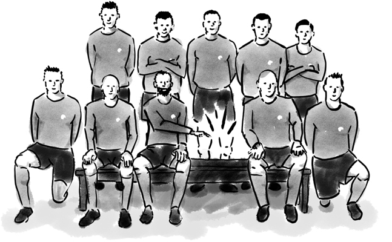
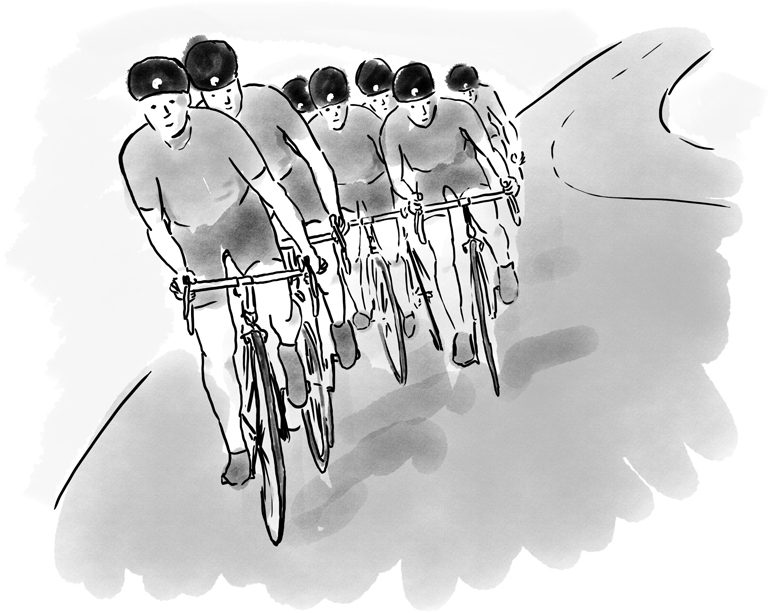
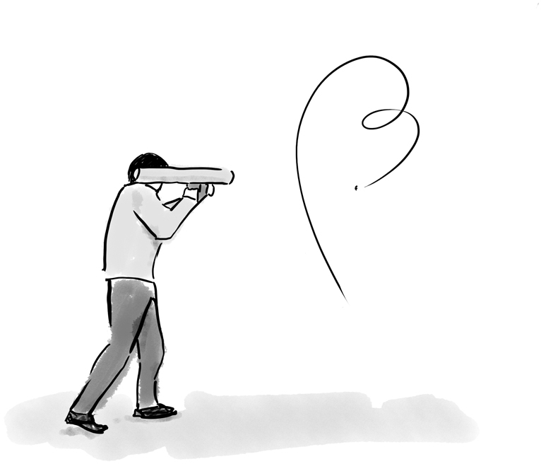
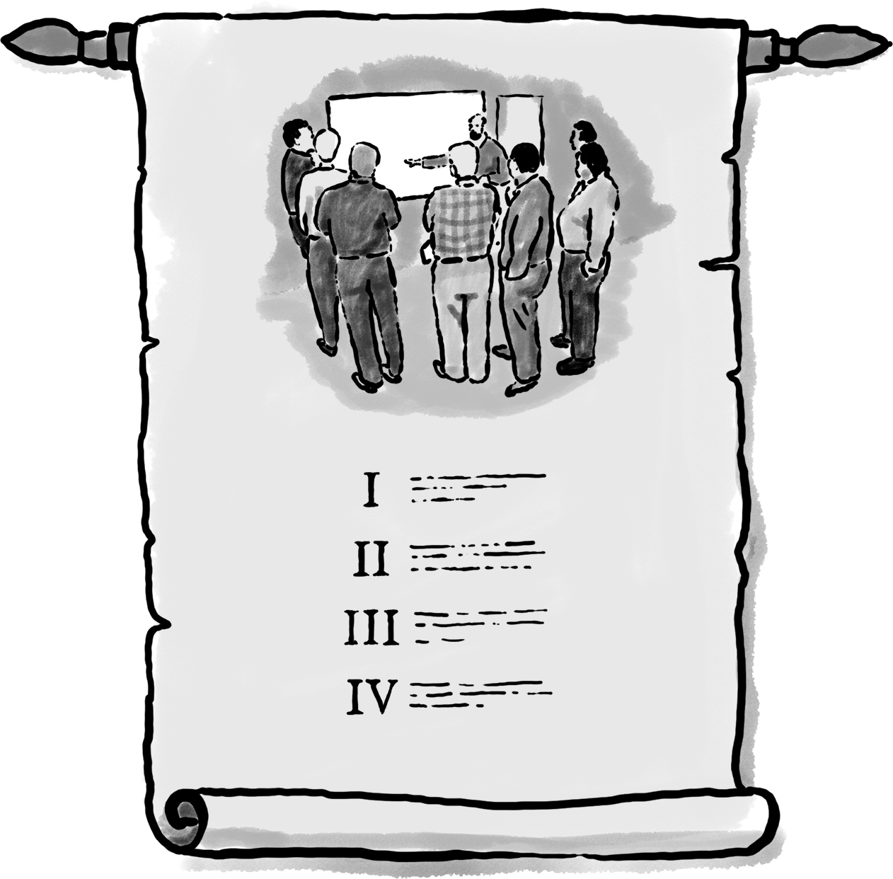
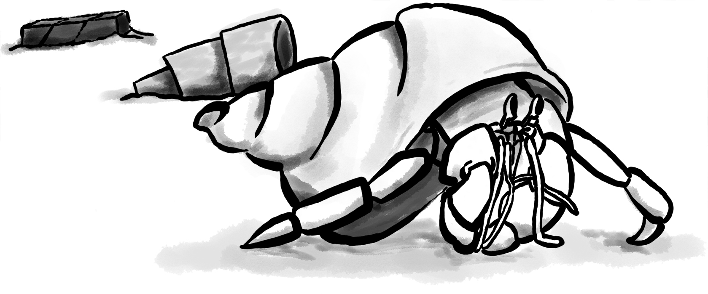
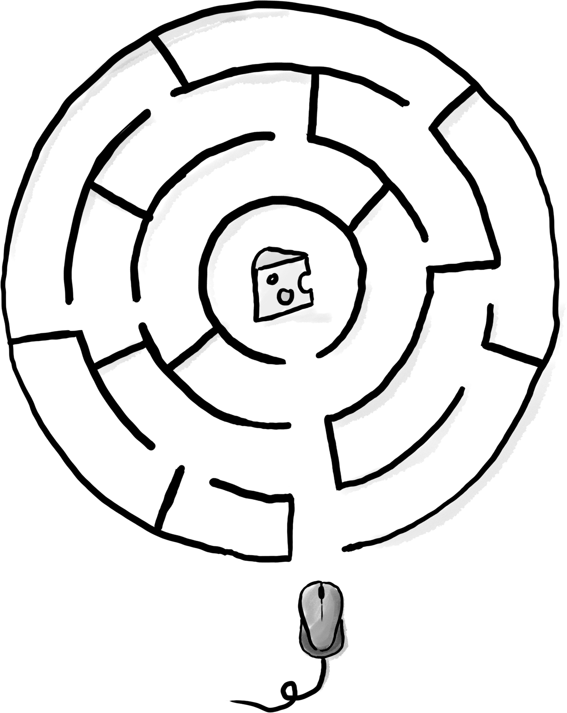
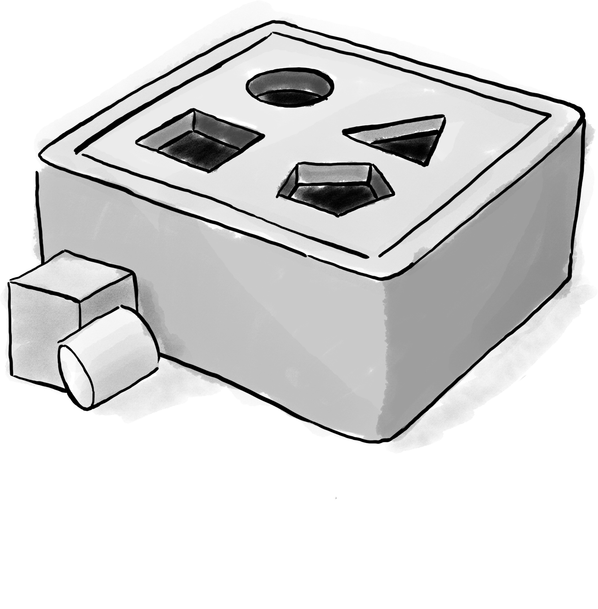
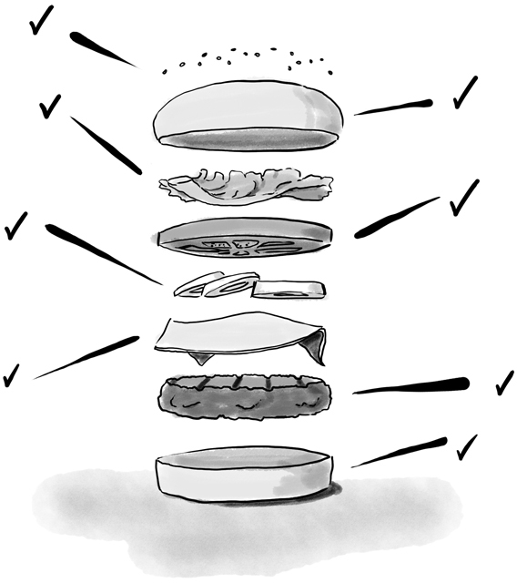
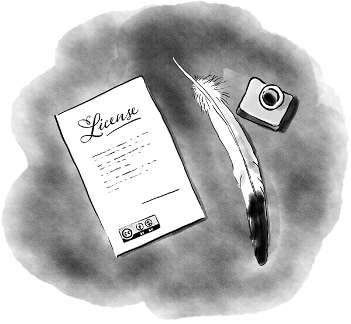

# Playbook

## Hello Sophilaber

This is the team’s playbook, your playbook.

Here you will find how you and your teammates should run our software
consulting company, as well as the tools and practices that should guide us
to create quality software products.

This document is in a continuous development process and you are a key player in helping it evolve.
Please contribute to it using [the Playbook's git repo](https://github.com/sophilabs/playbook).

> __Important:__ This document is a excerpt and combination of our
> [Guidelines](https://sophilabs.co/guidelines/) and our [Manifesto](https://man.sophilabs.io)
> for a quick overview.

## Values

We've learned from our experience that working with people that share the correct
[set of values](https://sophilabs.co/values) is the foundation for creating highly productive teams.

**Be bold** and encourage everyone else to stand out above the average.

**Stay sharp**, a great product is the sum of perfectly well-thought-out
details.

**Be Honest**, never sacrifice honesty for politeness.

**Be a team player** helping pursuing other people’s goals as if they
were your own.

**Love your craft** and strive to transcend through your creations.

## Culture

Our main objective is to be an outstanding team of designers and engineers. If necessary, we will
eliminate or simplify any policy that makes us diverge from that goal. Most of the time you won’t
find a policy, instead we encourage you to "use your best judgement".

We avoid departments and prefer to use just a few hierarchies. We like composition of roles
necessary for projects and company objectives over inheritance of bosses and direct reports.

We avoid having private conversations about each other or clients. Instead, we talk in person, and
use tools such as Slack, Jira and GitLab to communicate openly within a project, within sophilabs,
and publicly.

We prefer open offices where everyone can see each other, encouraging people to collaborate
spontaneously but still maintaining a quiet work environment. We say, “Work comfortably while
keeping the stillness of a library”. There are many places for entertainment so you can rest when
you need to without disturbing your teammates.

Our standards are very high, and bringing on a new team member requires a "yes" from everyone who
participated in the interview process. Therefore, we expect the best from each other, give each
other the benefit of the doubt, and encourage each other to take initiative to improve ourselves and
the company.

Except for a few roles with pure management responsibilities, everybody at sophilabs must dedicate
at least part of their time to programming software, a customer project, internal tools, or to the
Research and Innovation working group.

## Time

We work at a [sustainable pace](http://www.extremeprogramming.org/rules/overtime.html). We dedicate
up to two days per month as “investment days”. We typically distribute investment days in the team
in order to have at least one member dedicated to the project everyday. If a team member is absent
from client work because of illness or study holidays, we'll use investment days as extra client
days to avoid slipping behind schedule. When taking time off during client work, we discuss how it
will impact the schedule with other team members.

Sending off-hours communication may create an unintended sense of urgency with the recipients of
your message. Try to avoid creating that urgency when possible. Unless actually urgent, you may
ignore off-hours messages which you receive and handle them once you are back at work.

### Time tracking

We work and bill our customers by the hour, so making that every invested hour counts is very important.
We track the time we invest on different projects in [Hours](https://hours.sophilabs.io) using as
much detail as possible when documenting what we do.

If we worked for a specific ticket, we track time directly in the tasks management system as they
will be imported automatically by the tool, this is important to avoid typing them twice and to be
able to generate time investment reports within the tasks management tool.

### Activities

When tracking time at Sophilabs we have to categorize the type of time investment we are doing by
providing an Activity.
They can be typed when creating the time entry in [Hours](https://hours.sophilabs.io), or by
appending it as a hashtag in the tasks management system's time entry log, i.e.: "Deployed a new
service for handling I/O exceptions. #deployment". If no hashtag is provided, `development` will be
assumed.

The activities we use are:

- **Analysis**: when analyzing an issue or exploring ideas.
- **Code review**: when reviewing code.
- **Email/Chat**: when communicating over chat or e-mail.
- **Configuration**: when configuring tools or services.
- **Deployment**: when deploying new code to an environment.
- **Development**: when programming.
- **Documentation**: when writing documents/pages/blog posts.
- **Management**: when managing stuff.
- **Not paid time off**: when taking not paid time off.
- **Lecture**: when giving a talk or presentation to an audience or teaching something to someone else.
- **Paid time off**: when taking paid time off.
- **Meeting**: when meeting face-to-face or remotely with someone else.
- **Support**: when helping an user.
- **Testing**: when manually testing software.
- **Training**: when learning something new.
- **Travel**: when traveling during a company trip.
- **Visual Design**: when designing new UI/UX/marketing material.

### Patch

It's a special activity used to adjust the sum of hours a day should have. i.e.
I have to work 8 hours a day but for some reason I did 7, to complete 8 hours for that day I create
a 1 hour patch entry explaining why I could not complete 8 hours.
Patch entries could also be negative if I worked more than 8 hours a day.

Patch entries are very useful so we are able to "close" days without any human intervention.
At the end of the month when we prepare the bill for our customers, we just make sure that the month
was properly closed so no more modifications are allowed.

### Staying focused

Sometimes we need to stay highly focused to solve challenging problems properly and we want no
interruptions from our team, during those moments we listen to our favorite music avoiding any
program or podcast that requires attention, or we just move temporarily to a more quiet and
isolated space.

### Consulting

Our main business is consulting projects. Those projects start with sales and go through a normal
flow of designing, developing, shipping, monitoring, and iterating. The goal is to do such a good
job for our clients that they want to poach us, and to be such a great place to work that we can be
confident our teammates won't leave.

### Investment

Investment days are days for investment in ourselves, our company, and our community. Primarily this
means doing something that interests us like defining best practices, investigating a new framework,
contributing to open source, writing a blog post, attending community events, or reading an
educational book. The goal is to encourage individuals to improve and share their knowledge with the
rest of the team.

The time you invest during these days must generate value in different forms:

- Picking from or contributing to guidelines and playbook
- Completing squads’ pre-defined tickets
- Contributing to or creating open source software
- Writing a blog post
- Exploring change to tools and processes on the "R&I" Jira project
- Working on conference and meetup talks and proposals
- Working on Sophia or other internal projects

When taking an investment day we follow the same steps as we were taking a
[short vacation](https://man.sophilabs.io/#short-vacations) to let the team and PO know about it in
advance.

### Being "On Bench"

There is a difference between a normal investment day, and extended downtime between client projects
(being “on bench”).

Extended periods of time between client projects should skew heavily towards revenue generating
activities. This could be working on existing revenue generating products and services, networking
and sales, or creating something new that will generate revenue.

Because this extended time period will go away when you resume client work, and because we can't
sustain non-revenue generating activities for long, approach this extended time between client
projects with a sense of urgency.
Validating ideas, shipping, and getting to revenue generation as quickly as possible should be a
priority. We shouldn't go weeks without results to show, and we should impose the same constraints
and processes as we do on client projects.

## Laptop

### MacBook Pro

Every person who joins sophilabs receives a MacBook Pro latest generation.
These laptops are known for their performance, robustness, great look & feel and battery life, but
for us, the most important feature is that they allow us building and testing apps on any platform:
OSX, Linux and Windows.

### Text Editor/IDE

> *Plain text won't become obsolete. It helps leverage your work and simplifies debugging and
> testing. The editor should be an extension of your hand; make sure your editor is configurable,
> extensible, and programmable.*
> __The Pragmatic Programmer__

We encourage everyone to be an expert using his/her favorite programming tool. Know every shortcut
and automate repetitive tasks to gain more productivity so you can focus on building the software
the way we want.

## Technology

Early in a project, we have to decide which platforms we'll use. Which platform depends on our ideas
for solving the users' problems. For example, if they're construction workers on a job site, a
mobile or tablet interface might be the best choice.

After considering what's best for users, consider what's best for us:

- The tools are open source with a strong community
- The tools make us happy
- The tools help us create and iterate quickly

### Web Apps

In our experience, teams using the [Django framework](https://www.djangoproject.com/) can bring
products to market more quickly and with a lower total cost of ownership than other tools. There's
also strong overlap between the agile and Python communities, which means (among other things) that
Python developers tend to write adaptable modules, write tests and avoid repeated code.

In addition to Python, we use other open source software and web standards such
as HTML, CSS, JavaScript, UNIX and Postgres because they:

- Are high quality.
- Avoid vendor lock-in.
- Provide flexibility to switch components.
- Work on many devices.
- Are battle-tested.
- Have few bugs when seen by many eyes.

Django comes with features that decrease the burden on the programmer to protect against security
attacks such as:

- Cross-Site Scripting (XSS)
- Cross-Site Request Forgery (CSRF)
- SQL injection
- Header injection

Django helps us do the right thing with regards to security but we are still required to be
diligent, knowledgeable, and test comprehensively.
We support Internet Explorer 10+ and the latest versions of Firefox, Chrome, and Safari. We do not
support Internet Explorer 6, 7, 8, or 9. Those browsers are
[losing market share](https://en.wikipedia.org/wiki/Internet_Explorer#Market_adoption_and_usage_share),
they have [security issues](https://en.wikipedia.org/wiki/Internet_Explorer_6#Security_issues), and
they are time-consuming to design for, develop for, and support.
On mobile devices, we support iOS Safari 7.1+, Android Browser 4.4+, and the latest version of
Chrome for Android.
In limited special cases, user demographics will dictate that supporting an older version of
Internet Explorer is required. Those special cases should be identified early on so we can plan for
additional time and expense in order to support the version.

### Mobile Apps

"Mobile" refers to the user, not the device.
Everything about how we design a mobile application has to be in the context of that idea. It raises
questions like:

- Are they moving?
- Are they relaxed on a couch?

We try to start with the most usable platform first. If the device needs the camera, calendar, or
address book, an “hybrid” app for iPhone, iPad or Android may be the right choice. If the app is
targeted for a massive audience and/or the app performance is critical we recommend developing two
separate “native” apps for iOS and Android.

For other products, especially content-only products such as text, images, videos, and landing
pages, a mobile web app makes sense because:

- All modern smartphones can render HTML.
- We can create and iterate quickly.
- We can deploy new versions multiple times a day.

Our mobile engineers make use of their expertise with React Native to
create multi platform apps and Swift when we want to create platform specific
apps for iPhones, iPads or Apple Watches.

### Programming Languages

Examples of languages we typically use are:

- Python, NodeJS or Elixir: our server-side preferences
- Javascript: our client-side preference for web and mobile hybrid apps

### Frameworks

Examples of frameworks we typically use are:

- Django
- Phoenix
- Flask
- Express
- HapiJS
- Loopback
- Phoenix
- Angular
- React

A framework is a library that makes performing a particular task in a
programming language easier. Like the framework of a house, it is there when we
begin programming and is always there giving the program structure and support.

### Databases

For data that must be saved and stored correctly, we use [PostgreSQL](http://www.postgresql.org/)
(we usually refer to it as "Postgres").
It's a thirty-year-old open source database that is highly respected, is well supported by
documentation and hosting providers, and can be used by any developer who knows the SQL standard.

In recent years, a movement called [NoSQL](https://en.wikipedia.org/wiki/NoSQL) has gained
popularity. Best translated as "not only SQL", tremendous effort has been made to create different
kinds of databases for different use cases, often based off
[academic or industry research](http://nosqlsummer.org/papers).

Our most frequently used NoSQL database are [Redis](http://redis.io/), which we use for storing
transient, high quantity read/write data such as activity feeds, tags, background jobs, sessions,
tokens, and counters; [Cassandra](http://cassandra.apache.org/) which we use for storing time series.

Redis and Cassandra are reliable, open-source, and simple. They offer high performance and reliable
predictions of its performance.
When we need to do full-text search on documents, we use [Solr](http://lucene.apache.org/solr/).
Its major features include hit highlighting, faceted search, real-time indexing, dynamic clustering,
database integration, and rich text documents handling.

### Licenses

In contrast with a proprietary license, the source code of an open source program is made available
for review, modification and redistribution. The difference between open source licenses is what we
can and can't do with the source code.
Open source licenses can be divided in two categories: permissive and copyleft.

Permissive examples include:

- [Berkeley Software Distribution (BSD) licenses](https://en.wikipedia.org/wiki/BSD_licenses)
- [MIT license](https://en.wikipedia.org/wiki/MIT_License)
- [Apache license](http://en.wikipedia.org/wiki/Apache_License)

A copyleft example is the
[General Public License (GPL)](https://en.wikipedia.org/wiki/GNU_General_Public_License).
Both categories have the purpose of establishing the copyright holder for the software, granting
users the right to copy, modify and redistribute it, protecting the copyright holder from any
potential guarantees that the software may provide (software is provided as-is), and optionally
imposing some restrictions.

Permissive licenses let us modify a program, redistribute it, and even sell it.
We can embed or link code with other programs without restriction or explicit permission by the
copyright holder.
Copyleft licenses only allow us to link or distribute code with other code that has the same
license. It also forces modifications to be released under the same license. Combining anything
with the GPL makes it GPL.

Non-copyleft licenses do not enforce derivative works to also be open source.
Some software is released under a dual license: both a permissive and copyleft license. This
provides developers who use the dual licensed code to apply the license that better suits their needs.

Most of the software we use has a permissive license:

- PostgreSQL, PostgreSQL License (BSD based)
- Redis, BSD
- Solr, Apache License 2.0
- Python, Python Software Foundation License (PSFL) (BSD based)
- Django, Django license (BSD based)
- AngularJS, MIT

## Methodology

### The Agile way

We adhere to the [Agile Manifesto principles](http://agilemanifesto.org/principles.html), declaring
that our highest priority is to satisfy the customer through early and continuous delivery of
valuable software.
We welcome changing requirements, even late in development as we understand that agile processes
must harness change for the customer's competitive advantage.

We say that working software is the primary measure of progress, and as a result we aim to deliver
working software in the shortest amount of time, usually within one or two weeks.

Agile processes promote sustainable development. The sponsors, developers, and users should be able
to maintain a constant pace indefinitely and must work together daily throughout the project.

At regular intervals, we reflect on how to become more effective, then tune and adjust our behavior
accordingly. We look for a motivating environment and culture, where everybody trusts each other to
receive constructive feedback and get the job done.

We strongly believe that continuous attention to details and technical excellence enhances agility.
Lastly, we believe that simplicity --the art of maximizing the amount of work to avoid-- is
essential, at every level.

In our experience we have seen that the best architectures, requirements, and designs emerge from
self-organizing teams who truly understand these principles.

### Agile Master

The agile master is not a project manager, they are also not technical or design leads.
The agile master is the `guardian of the process`.

They keep an eye on the project process, making sure that the team is focused on delivering value
on every iteration, receiving timely feedback and adapting to change as quick as possible.
They run periodic meetings to ensure there is an effective communication between all team members.
They help the team running periodic surveys to ensure Product Owners and stake-holders voices are
heard.
They express enthusiasm when the team is in a groove and helps as a problem-solver when things get
off track.
When appropriate, they work closer with the client to help removing blockers or either coaching them
to improve their Product Owner skills.

### Project kick off

A kick off meeting is set up whenever a project starts,
please use this document to guide the presentation.

After that, the following stuff is set up:

- Project mailing-list: [project@sophilabs.com](project@sophilabs.com), which includes the client
  and [project-dev@sophilabs.com](project-dev@sophilabs.com), which include only the technical team
- Jira tracker (provided by client)
- Gitlab or Github repositories (provided by client)
- Jenkins project (provided by client)
- Access to cloud service (security groups and roles)
- Google docs folder (ask client for a documents repository or use docs.sophilabs.io instead)

### Planning

Contrary to common misconceptions, planning is fundamental to Agile. That being said, planning is
done in a rather unique way: with Agile we focus on planning for the work at hand and getting it
"just right", while traditional approaches would require full upfront planning for every possible
feature without accounting for change.

#### Prerequisites

- The whole team must be present: Product Owner, Development Team & Agile Master.
- The Product Owner must bring an updated Product Backlog (PBL) reflecting his product's strategy.
- Team-wide agreement about using **process quality-assurance elements (Such as "Acceptance Criteria"
  & "Definition of Done")**

The most important planning instance occurs at the beginning of every iteration, its objective is to
determine the expected value to be realized by its expiration through the finished product increment.

This is addressed by answering two questions:

- **"What" will we build to increase the product value?**. This aligns with the product strategy.
- **"How" are we going to build it?**. This represents the development team's tactical approach to
  deliver results.

#### Answering the "What"

- **Settling for an iteration goal**. The whole team should agree on it by discussing the PO's
  strategic perspective.
- **Forecasting the amount of work that will be completed during the iteration**, in context of the
  iteration goal. This is called an "Iteration Backlog".
- **Agreeing on clear Acceptance Criterias**. The PO should be able to convey a clear understanding
  of what each piece of work needs to have from a functional or UX perspective in order for him to
  accept it as done.

#### Answering the "How"

- **Defining a "tactical plan"**, roughly outlining how the development team will tackle work to
  deliver the expected results and which tools (such as a "Definition of Done") will they use for
  said end.

#### Defining a "Done" criteria

The "Done" criteria or *"Definition of Done (DoD)"* is a quality related tool, used to enforce all
elements each unit of work must comply with from a development perspective. The Dev team uses the
DoD as a checklist to guide the development of a quality product. Organizations such as ours commonly
have a base DoD, but teams tend to build on top of them including project-specific valuable elements
when deemed approrpiate.

- **Our base organizational DoD is:**
  1. Feature is tested against acceptance criteria.
  2. Unit/functional tests written and passing.
  3. Integration/load tests passing.
  4. CI successful build and linters passing.
  5. Project deployed and working on the test environment identical to production.
  6. Feature ok-ed by UX designer (If applicable).
  7. Peer code & QA review performed and issues resolved.
  8. Documentation updated (If applicable).

The result of good planning is a defined **Iteration Plan**, the sum of:

- A strategic **Iteration goal**.
- A purposeful **Iteration Backlog** with clear **Acceptance Criteria** for all work.
- The dev team's tactical plan, enhanced with a relevant **Definition of Done**.

### Estimation

Work Estimation through relative sizing is instrumental for achieving all of the planning session
goals; through this process the Dev. team uses its knowledge to try and determine the size of
Product Backlog requirements, while the PO will rely on his product/business experience to make
sure such requirements are clear and fully understood by the Developers.

We tend to prefer "Planning Poker" and "Two-pass" amongst all existing relative sizing techniques,
and we use a trimmed scale with Fibonacci numbers from 1 to 13 in all our projects. We've also laid
scale descriptions as loose guidelines to facilitate its use:

- **1: Tiny effort** - a "zero-complexity/zero-uncertainty" bit of work. Can be easily fulfilled
  within a day's work, usually just in a couple of hours tops to complete.
- **2: Small effort** - a "low-complexity/zero-uncertainty" bit of work. Roughly "double" the amount
  of work of a "1", it'll likely take a day's work or even a bit more to complete.
- **3: Regular effort** - a "low-complexity/low-uncertainty" bit of work. Roughly "double or less"
  the amount of work of a "2", it'll easily take a day's work up to a couple more days to complete.
- **5: Big effort** - a "medium-complexity/medium-uncertainty" bit of work. Distinctively bigger than
  a "3", It'll most likely take no less than a couple days of work to complete.
- **8: Very Big effort** - a "high complexity/high-uncertainty" bit of work. Distinctively bigger
  than a "5".
- **13: Epic/New Feature** - a "highest-complexity/highest-uncertainty" bit of work. Perceived as
  being distinctively bigger than an "8" and highly uncertain, requirements with this profile are
  deemed as "Epics".

We've also laid down the following rules depending on estimation size:

- **Only requirements from 1 up to 3 can be included in the Iteration Backlog.** 5's can
  exeptionally be included, given the dev. team has capacity and the PO commits to clearing all
  uncertainty
- **Requirements from 5 up to 13 must be further refined** and splitted into smaller, more specific
  requirements
- **Requirements  with a 13 are immediately deemed as "Epics"**, which means they must be treated as
  new features

### Tasks

We have used Jira, Redmine, Pivotal Tracker, Asana, Trello, and other task management systems over
the years. The following section details a process that uses Jira, however the overall process
remains relatively the same if other tools are used instead.
No two products are the same, so flexibility in the product development process is important. Jira
responds well to changing the structure of the process "on the fly."

In any task management system, it's important to have a clear understanding of the product
development process.
The Current Sprint is the only prioritized list to which the product team should refer to in order
to know what to work on next.
It represents two weeks of work.
A story represents a job story, bug fix, engineering task, or general todo.
Stories start out as a simple idea, 1-2 sentences long.
Detail is then added, including descriptive wireframes and explaining why (from a business
perspective) we are focusing on it.
Notes on suggested implementation are often added, and at times it is also a good idea to include
the acceptance criteria of the story.

Once the stories in the Sprint have been prioritized and vetted, they are ready for design and
development. A designer or developer "puts their face on it" by assigning it to themselves and
pulling it into the In Progress column.
The stories in the In Progress column are actively being designed or developed.
You should never have your face on more than two stories at a time.
Work is done in a feature git branch. When a designer or developer creates a pull request for their
feature branch, they move the story to the Code Review column. All reviewers must "put their face on
it" while reviewing.

### Standups

Every morning, each project team gets together for 15 minutes.
We talk about the current sprint goals and how we are in regards to it, reprioritizing tasks if needed.
We immediately resolve blockers together or help the person in need following the standup.

We do this in order to:

- Align ourselves to the sprint's goal
- See each other face-to-face
- Learn what others are doing in order to help them

### Biweekly Retrospective

Once every 2 weeks, everyone involved on a project meets in-person or via video conference to
perform a retrospective analysis.
This is an opportunity for the entire team to discuss achievements, hurdles, and concerns. The goal
is that everyone leaves feeling excited and empowered for the weeks of work to come.

The agile master runs this meeting aiming to:

- Understand how the team feels about last 2 week's progress and what's to come.
- Have each member of the team voice any risks or concerns; after everyone has had the opportunity
  to bring these up, work together as a group to mitigate these concerns. Encourage everyone to
  voice the same concerns even if they've already been mentioned; it helps prioritize what the team
  is most concerned about and should spend the most time fixing. This is an opportunity to discuss
  how to improve the process and product we're building together.
- Celebrate success. We review the work we shipped, showing the actual product, and congratulate
  those who made it happen.
- After the retro is done, we share the notes with the team and ensure anything actionable from the
  retro is captured. This allows teammates to view progress, understand how feelings on the project
  change over time, and accomplish anything we set out to do given the outcomes of the retro.

Based on the answers to these questions, we record our plans in the task management system:

- Archive the two-week previous sprint
- Review product design priorities. Pull what we estimate to be an appropriate amount for next
  sprint into the Backlog
- Review bugs. Pull any important bugs into the Backlog and prioritize them at the top of the queue
  before everything else. We want to always be fixing what's broken first
- Review engineering and refactoring tasks. Pull stories into the Backlog based on what the designers
  and developers believe is appropriate given the previously stated product design and bug tasks
- Ask the Product Owner to re-sort the entire Backlog according to priorities

The task management system is the canonical repository for plans.
When things are only said on the phone, in person, in emails that don't include the whole group, or
in one-on-one chats, information gets lost, forgotten, or misinterpreted. The problems expand when
someone joins or leaves the project.

We could be called "aggressive" with our approach to cutting features, budgets, and schedules. It's
hard to say "no." as it is usually not well-received. There's a reason someone requested a specific
feature.
We have to battle sometimes in the face of "yes". We do so armed with knowledge of
[the history of software success and failure](http://blog.codinghorror.com/the-long-dismal-history-of-software-project-failure/):
in 2004, only 34% of software projects were considered successes. The good news is that that was
100% better than the stats in 1994.
"The primary reason is the projects have gotten a lot smaller."
Few software projects fail because they aren't complicated enough. Saying "no" means keeping the
software we're building as simple as possible. Every line of code we write is an asset and a
liability.

Simple software, once launched, is better suited to meeting the demands of
customers. Complex software, if it ever launches, is less capable to respond to
customer demands quickly.

## Product Design

### Wireframes

It is crucial to put the design of the application ahead of the development.
Focus should be placed on wireframing usability, user experience, and flows.
We find it important to keep the design and development cycle adequately tight.
We do not wireframe one month out because as we approach certain areas of the product, we often
decide to cut or change features.
Those changes are an expected part of the iterative process and feedback loop between the client,
the sophilabs team, and users. It would be wasteful to spend time wireframing features that never
get built or building features that won't be used.
The designer will refine the sketches into HTML and CSS wireframes.
HTML and CSS wireframes are built on [moqups](https://moqups.com/). It also allows developers to
start implementing features within the wireframes.

## User Experience

### User Interface

In the context of our software, the user interface is the individual view that allows for goal
completion.

We evaluate interfaces on the following criteria:

- Puts outcomes first
- Provides users with affordances
- Congruent with surrounding platform
- Consistent across entire application

We put the user's goals first.
No one is using our software solely because it looks nice.
There's a reason they sought out our solution.
Our number one priority is making that outcome desirable and easily attainable.
We make software easy to understand. It's not enough to be functional, users must know capabilities
exist and be able to anticipate how the software is going to react to their inputs.
Our software should be as intuitive as possible.
We remain consistent with platform guidelines. Interfaces look and feel best when they are congruent
within their context, rather than being strictly branded across all platforms. We prefer common
patterns when designing, and we maintain consistency. Usable interfaces work as expected across the
entire application.

### Interaction Design

Interaction gives users the ability to change the canvas, and to directly manipulate it.
Designing those interactions is what makes our software come to life. Interactions should provide
affordance — [animation](http://medium.com/p/926eb80d64e3), for examples, can be used as a powerful
metaphor to help a user understand an interface.
Interactions help guide a user from the beginning of a task all the way through it's completion.

Designers guide these interactions from prototype to implementation. For web applications we start
in the browser. For review, we use gifs to demonstrate interactions.

### Visual Design

We refer to an application's visual design exclusively as its style.
We use the [universal design principles](https://thoughtbot.com/upcase/design-for-developers-resources/principles)
to communicate and bring order to those ideas in our applications.

Those fundamentals include, among others:

- Alignment (often achieved with grids)
- Emphasis (often achieved with size, position and color)
- Consistency (buttons, links, headers typically look alike)
- Whitespace (elegant, timeless, gives eye a rest)

Successful visual designs typically don't draw attention to themselves.
The content will be front-and-center. The workflows throughout the site will be obvious. Resist
the temptation to aim for a design that is "memorable" or a design that "pops."

Successful designs are usable.

## Development

Our development practices are based on the [Agile Manifesto](http://agilemanifesto.org/principles.html)
and a subset of the [XP practices](http://www.extremeprogramming.org/).
We adhere to their principles, and have found that applying them greatly improves the quality of our
work as well as the happiness of our team.

### Version Control

We always use source code control.
It's like a time machine because it enables us to work in parallel universes of our source code,
experimenting without fear of losing work and rollback if something goes wrong.
[Git](http://git-scm.com/) is an open source code control system written by Linus Torvalds.
It's fast and great for working in branches.
Additionally, we prefer to use [Gitflow](https://github.com/nvie/gitflow) for branches and release
management.
We also use [GitLab](http://git.sophilabs.io) for hosting our git repositories.

### Style Guide

We write code in a consistent [style](https://sophilabs.co/guidelines/) that emphasizes cleanliness
and team communication.

High level guidelines:

- Be consistent
- Don't rewrite existing code to follow this guide
- Don't violate a guideline without a good reason
- A reason is good when you can convince a teammate

### Pair Programming

Code that is written by two people who sit next to each other at the same computer is
[pair-programmed](http://www.extremeprogramming.org/rules/pair.html) code. That code is considered
high quality and should result in cost savings due to less maintenance.
In the long run, this style of development saves money because fewer bugs are written and therefore
do not need to be fixed later.
When you are writing an important piece of code, don't you want another person to look it over
before it goes into production?
This is a good indication that pairing is beneficial and should be done more often. While we don't
pair program all the time, we recognize that it can be difficult to act as a team when working at a
distance. Which is why
we believe that. There is no better collaboration between designers and developers than at the keyboard.

### Code Reviews

Here's the flow. Read our [git flow based protocol](https://guidelines.sophilabs.io) for the git
commands.

1. Create a local feature branch based on dev
1. When feature is complete and tests pass, stage the changes
1. When you've staged the changes, commit them
1. Write a good commit message
1. Share your branch
1. Submit a merge request
1. Ask for a code review in your project's [slack channel](https://chat.sophilabs.io)
1. A team member other than the author reviews the merge request. They follow the
   [Code Review guidelines](https://guidelines.sophilabs.io) to avoid miscommunication
1. They make comments and ask questions directly on lines of code in the GitLab web interface or in Slack
1. When satisfied, they comment on the merge request "Ready to merge."
1. View a list of new commits. View changed files. Merge branch into dev
1. Delete your remote feature branch
1. Delete your local feature branch

## Testing

### Test-Driven Development

[Test-Driven Development](http://www.extremeprogramming.org/rules/testfirst.html)
(TDD) is one of the most important Extreme Programming (XP) rules, but we need to be very careful
how applying it, as it may add a significant amount of code that could make us move slower.
One of the great benefits of TDD is that it enforces the design of testable components, being a good
practice to create clean and maintainable code.
We have some suggestions to encourage the creation of tests for component interfaces avoiding a high
coupling with the implementation details:

- Don’t test private methods
- Test the more generalist method that is closer to the user instead of each one responsible for the
  smaller tasks

### Acceptance Tests

Acceptance tests are code created from stories’ acceptance criteria. This code is run against the
application. When executed for the first time, the test will fail. The developer writes application
code until the test passes.
Once the test passes, the developer will commit the code into version control with a message such as:

`Author creates post`

The code is then run on the Continuous Integration server to make sure the acceptance test still
passes in an environment that matches the production environment.
Every time the code is pushed to the dev branch, the staging environment is automatically updated so
that anyone can see the current status of the project.

When the acceptance test is green for the CI server, and you along with any other designers,
developers, or clients are satisfied that the jobs story is complete on staging, the feature can be
deployed to production at will.
This can result in features being pushed to production very frequently, and therefore, more value is
being delivered to customers sooner.

### Continuous Delivery

Martin Fowler has an
[extensive description](http://martinfowler.com/articles/continuousIntegration.html) of Continuous
Integration. The basics are:

- We have a test suite that each developer runs on their own machine
- When they commit their code to a shared version control repository, the tests are run again and
  "integrated" with code from other developers

This helps ensure that there's nothing specific to the developer's machine making the tests pass.
The code in version control needs to run cleanly in production later.
So before the code is allowed to be pushed live, it is run on a CI server or service.
When a build fails, we get alerts in Slack and via email. Click the alert and we see a backtrace
that gives us a hint on how to "fix the build."
When we write the fix and commit to version control again, we'll get a "passing build" alert in
Slack and via email. Click the alert and we see the passing build.

`Green is good.`

A solid test suite is an absolute requirement for a web application in our opinion. However, one
major problem with test suites is that they get slow as they get large.
CI can ease the pain by distributing the test runs in parallel.
We've used Bamboo, Hudson (now called Jenkins), and other CI libraries that we manage ourselves.
We use [Travis CI](https://travis-ci.org/) for open source projects. We use
[Jenkins](http://ci.sophilabs.com) for private repositories.
CI test runs are triggered by GitLab post-receive hooks.

## Deployment

In order to save time and money, we focus as much as possible on the client’s product and the
outsource operations to external services.

### Domain Names

We suggest using [Domize](https://domize.com/) to see what's available.
Use [DNSimple](https://dnsimple.com/) to buy and maintain domain names if a client doesn’t hasn't
registered a domain name yet.

### SSL Certificates

Buy a [wildcard certificate from DNSimple](https://dnsimple.com/ssl-certificate).
The wildcard (*) lets you use the same certificate on www., staging., api., and any other future subdomains.
SSL and DNS are tightly coupled. If we're doing any work with SSL, we need to make sure we have access
to make DNS changes, such as adding a CNAME record.
When working with a client that has a DNS department, schedule time during off-peak hours in order
to pair program with their
DNS personnel to ensure smooth sailing.
We can accidentally take down a site that is all SSL if this work isn't done methodically.

### Hosting

We use [Amazon Web Services](https://aws.amazon.com/).
The cloud and its services will empower our clients' businesses to start and operate in a way that
has never before been possible without significant upfront investment. File uploads for features
such as user avatars are uploaded to [Amazon S3](https://aws.amazon.com/s3/).

### Transactional Email

We use [Amazon SES](https://aws.amazon.com/ses/) and [SparkPost](https://www.sparkpost.com/)
(supports templates) to have our application deliver email to users, which is known as transactional
email.

Examples of transactional email are:

- Confirmations
- Follow ups after the first 3 days of use
- Free trial expiring
- Message another user in the system

### Payment Processing

We use [Stripe](https://stripe.com/) to collect payments from users via credit or debit card, as well
as for recurring billing.
It is a payment gateway and merchant account.
Charges for Stripe will vary depending on usage; successful charges are 2.9% + 30 cents.
There are no setup fees, monthly fees, or card storage fees

## Monitoring

We use [New Relic](https://newrelic.com/) to monitor performance of production applications.
Debugging performance might be the best part of a developer's job.
When there's a clear, numeric problem, we get to fix it and improve that number.
So we can say things like "We made this 175% better."
There are many established techniques for fixing performance problems:

- Amazon server clusters
- gzipping
- Asset pipeline
- SQL query caching
- ORM queries improvements

A number of them require developer thought:

- Database indexing
- Eager loading
- HTTP caching

Page caching is the most heavy-handed technique available, but if we are able to cache an entire
page and push it into a CDN, it will be the fastest option.

## Communications

Everyone who works at sophilabs has the responsibility to engage professionally with clients.
As a developer or designer, we are undoubtedly involved in emails, phone calls, or chats with
clients. In these interactions, we always demonstrate respect and professionalism.

### E-mails

All emails are archived and not deleted, so that a paper trail exists on any internal conversation
or client facing communications.

Also for the purpose of maintaining a paper trail, we ensure that a record of all sophilabs emails
remain in the google apps sophilabs site. This means that if we forward emails or use an email
client, all emails are recorded in google apps as well.

We use an appropriate [email signature](http://jsbin.com/qagebuw/edit?html,output) to maintain a
professional tone with clients at all times.

Protecting confidential information via email is also extremely important for us.
As such, we do not send passwords by email, and we are very careful in sending confidential documents
by email as well. As all email can be easily intercepted by third parties, no confidential
information should ever be sent to someone who is not “need to know”.

### Slack

We are always logged in Slack during work hours.
This decreases feedback loops for team communication.
Our slack account is found under [chat.sophilabs.io](https://chat.sophilabs.io).

### Discourse

We use the [Discourse platform](https://www.discourse.org/)
whenever we need to discuss software engineering related topics and get
general consensus.
The forum is opened for the world with read-only access, as a sophilaber you
might be interested in signing up to get writing access.

Check it out under [discuss.sophilabs.io](https://discuss.sophilabs.io).

### Data Security

We have some security guidelines in order to keep confidential information safe.

- We set passwords on computer for boot up and sleep
- We never send passwords using email, we use [1Password](https://sophilabs.1password.com)
- We create safe passwords
- We do not leave our laptop, computer, phone, or papers lying around unprotected
- We limit access to sophilabs networks and communication channels, email and phones

## Squads

We realized that in order to build a great company, it was necessary to divide our forces.
One of our core values is to *“be bold”*, so keeping in line with that, we’ve developed the
following challenging objectives:

- Hire the best people
- Work for the best companies
- Craft the best software
- Build something that people love

We have created specialized workgroups who strive to achieve those goals by defining universal
guidelines and ensuring they are always applied.

The current squads are:

- Code Analysis squad
- Deployment squad
- Methodologies squad
- Testing squad
- Security squad
- Software Design squad

### How they work

Every squad follows the same workflow (M.A.P.):

1. **M** easure teams and projects on different areas
2. **A** nalyze measurements in order to detect underlying issues and areas of improvement
3. **P** ropose changes via simple checklists that can be found on [guidelines](https://guidelines.sophilabs.io/projects/checklist)

Note that the squads are not responsible for actually implementing the best practices proposed.
Their execution should be part of the projects' goals and the team should talk about them on
standups and retros.

### Rules

1. Participation in squads is optional
2. Anyone can join up to 2 squads
3. The maximum capacity per squad is 3
4. Anytime we want to join or leave a squad we notify the team using the
  [#squads](https://sophilabs.slack.com/messages/C6X74NTV3/) slack channel. When multiple candidates
  are interested in the same vacancy, we use seniority as the criteria to solve conflicts
5. We document squads information, including members and roles in this
   [spreadsheet](https://docs.google.com/spreadsheets/d/1HS_aOPScwwfWdYkyJ6d1JupVl3FdNmWIIBZTGfy-NaQ/edit#gid=549058251)

### Metrics

Each squad defines its own objectives and principles.
In order to measure performance on different projects, metrics are needed. We use automated tools to
measure quantifiable metrics, as well as quizzes that we distribute periodically to teams and
customers to measure opinionated metrics.

### Dashboard

Whenever we want to know how our projects are performing regarding
software development best practices, we take a look at [dashboard.sophilabs.io](https://dashboard.sophilabs.io),
we also have TVs strategically placed around the office displaying it so we are all aware of them.

### Checklists

We have found that a short checklist is valuable when setting up a new project,
a production environment or preparing for a launch. We use to document tasks such as:

- Are long-running processes such as email delivery being run in background jobs?
- Are there redundant (at least two) web and background processes running?
- Are we using SSL? (See "SSL Certificates" section below)
- Are API requests being made via a separate subdomain (api.example.com)? Even if the same app, this
  gives us architectural flexibility in the future
- Are deploys done manually at a scheduled time when teammates are fresh and available if something
  goes wrong?
- Do deploys follow a well-documented script?
- Are we sending logs to a remote logging service?
- Are we using a AWS RDS service?
- Are we monitoring performance and uptime?

We document the projects [manifesto](https://guidelines.sophilabs.io/projects/manifesto/) and
[checklists](https://guidelines.sophilabs.io/projects/checklist) in guidelines.

### Code Analysis Squad

#### Objectives

Improve the quality of the code we write and help new team members adopt the best practices early.

- **Simplicity**: Minimize the effort required to understand a given source code.
- **Consistency**: Apply the same practices throughout the project and across similar projects.
- **Legibility**: The ability to understand the code at a statement level.
- **Scalability**: The activity of writing performant code at a statement-level.
- **Reusability**: The ability of a given piece of code to be reused in other projects without modification.

### Deployment Squad

#### Objectives

Ensure that systems deployed by Sophilabs are high performing, scalable
and always available; and that deployment processes are traceable,
visible, reversible and reliable.

#### Systems

- **Performance**: the overall response time of a system.
- **Scalability**: is the capability of a system to handle a growing amount of work.
- **Availability**: the probability that a system will work as required when required.

#### Processes

- **Traceability**: the ability to associate a released version to its source ticket and commit, and
  to trace any exception.
- **Visibility**: make the next release candidate version visible to stakeholders before actually
  releasing it.
- **Reversibility**: the ability to restore a system to a previous state
- **Reliability**: the deployment process is reliable

### Methodologies Squad

#### Objectives

Ensure that the software development processes used on different
projects encourage adaptability, integration, predictability, satisfaction,
simplicity and visibility.

- **Adaptability**: The team's ability to quickly adapt to unexpected changes
- **Integration**: Team and client are actively involved in the project
- **Predictability**: Estimated tasks were completed on time
- **Satisfaction**: Team, client, and stake holders are happy
- **Simplicity**: Doing only what is needed every time
- **Visibility**: The team is traceable and all documents and resources are accessible. The team
  proactively communicates to keep everyone on the same page

### Security Squad

#### Objectives

Protect Sophilabs and its clients assets: operations integrity and intellectual
property by guaranteeing compliance with the highest possible security standards.

- **Confidentiality**: Information, no matter its classification, is only seen or used by authorized
  users.
- **Integrity**: Any unauthorized information changes are impossible (or at least detected), and
  changes by authorized users are tracked.
- **Availability**: Information is accessible when authorized users need it, while accounting for
  proper balance between security and availability.

### Software design Squad

#### Objectives

Ensure that Sophilabs’ Software Design best practices encourage simplicity, consistency, scalability
& reusability.

- **Simplicity** : Minimize the effort required to understand a project.
- **Consistency** : Apply the same practices throughout the project and across similar projects.
- **Scalability** : The ability of scaling a system without the need of rewriting.
- **Reusability** : The ability of a given solution to be reused in other projects.

### Testing Squad

### Objectives

Ensure that software built by sophilabs has the necessary mechanisms to boost
its reliability, robustness and correctness in an execution environment.

- **Reliability**: The application should behave as expected.
- **Robustness**: The application should be able to continue operating despite abnormalities.
- **Correctness**: The application is compliant with the specified requirements.

## Sales

We want to design and develop software.
Before we can do that, we need clients to hire us. The following section details how our sales
process works and answers commonly asked questions by potential clients.

The overall process is:

- A potential client contacts us
- We arrange a Skype call
- Qualify/disqualify: are we a good fit for the client?
- Qualify/disqualify: is the client a good fit for us?
- Understand the client's vision
- Agree on the outcomes we're trying to achieve
- Estimate iterations
- Schedule people for iterations
- Sign the contract
- Pay a security deposit
- Start working

### Leads

Our leads often come to us from Google searches and client referrals.
Each lead is tracked on [Sophia](https://panel.sophilabs.io).

A salesperson will get assigned to the card for the incoming lead but anyone in the sales team can
take responsibility for that lead.
The person either responsible qualifies or disqualifies the lead, often with a quick intro email or
Skype call with the potential client.
We prefer to pair on sales calls, having at least one designer and one developer on the call. This
enables us to get multiple opinions on how good or bad of a fit the client and project might be for us.
It also gives us the ability to answer both design and development questions to the best of our
ability, and it allows us to train and improve our process during sales calls.

### Understanding Product Vision

Our goal is to begin thinking about the client's product and start working as a team to plan it even
before we officially start working together. Some example questions to ask are:

- What big benefit does the product provide?
- Who currently buys this product?
- Who do you want to buy this product?
- What do customers love about your product?

We distribute the sales process throughout the team. Potential clients should
be able to talk to the people they'll be working with.
We should be able to handle any spikes in incoming leads that make
it difficult for the sales team to respond in a timely fashion.

### Customer Availability

We work remotely every day with our customers, and tools like Slack, Gitlab,
and Jira have made that much easier over the years. An ideal consulting
project for us is one where a member of the client team is
available at all times. When that fails, we want to find out during the sales
process how available they will be.
If it seems like they won't be available very often, we should seriously
consider declining the project.

### NDAs

If the NDA is important to the client, it’s important to find out enough
about the business to evaluate whether or not there might be a conflict
with any existing or past clients. We will only sign it if it’s determined
that there is no conflict and the project is a good fit.

### Technical team

We offer a combination of designers, Python developers, and Javascript
developers.

Here we’ll outline how the team works.
The designer is responsible for designing interactions between users and the product, they write user
interface code.
The developers make it work. They write the code that makes the app "smart", and they aim to make
the product error-free.
Speed is a key feature of every application so they monitor performance.
Developers keep it running by making architectural decisions and interacting with modern-day hosting
companies. The developers also implement; they write and maintain HTML, SASS, Javascript, Python,
SQL, and lots of other code. They set and meet development standards, keep the
[Continuous Integration](http://www.extremeprogramming.org/rules/integrateoften.html)
build passing, and review each other's code.
In addition, an agile master assists the team for a few hours a week

Anyone at sophilabs should be able to advise a project. If the primary salesperson is not also the
agile master, there should be a smooth hand-off from one to the other.

While each person plays a role, a team needs to be a team.
Everyone is responsible every day for delivering high quality work, for staying true to the vision
for the product, for communicating their schedule and intentions, for making hard decisions, for
delegating to others when they don't have the time or skill to accomplish a task, for keeping team
morale up, and for being consistent.

### No Fixed Bids

Some consulting relationships start with a requirements document. The requirements are often
extremely detailed.
The probability of this document containing the optimum feature set is extremely low. The right
features are better learned through user interviews, prototyping, releasing actual software, and
getting feedback from real users.
Based on that document, clients expect consultants in the industry to submit an exact timeframe and
bid. This contract style sets the client and consultant working against each other from day one.
Instead of focusing on designing the product experience or evaluating what assumptions were wrong,
they end up spending time negotiating about what was meant in a document written a long time ago or
focusing on arbitrary deadlines.
In fact, it's worse than negotiating, it's retroactively discussing something that no one remembers
the same way.
As you might have guessed, we don't do fixed-bid, fixed-feature-set proposals.

### Budget

We [do need to know clients' budget](https://medium.com/what-i-learned-today/a61ec864c898).
This is often uncomfortable for them but their budget helps determine what scope is possible.
It saves time. If they don't know their budget, we discuss different options.
We talk about breaking product rollout into stages and try to improve the product's chances of
success at each stage by:

- Focusing on a small subset of features.
- Designing a valuable user experience.
- Developing a meaningful relationship with users.

### Rate

We price projects at a per person, per hour rate. We work a minimum of 32 hours per week.
We use the same rate for designers and developers. The work required for each week dictates which
skills are needed. The number of people needed determines the cost and how much gets done.
During the process of explaining our billing, we sometimes tell potential clients "time and
materials" is the same as hiring an employee for their annual time with less risk to them because:

- Our team is experienced. We've interviewed hundreds of candidates in order to find the talented
  group of people we work with today
- We've worked together on projects before. We have "a way" of doing things
- Short projects require less money
- Our time is predictable (32 hours/week) and consistent
- We can quickly rotate in a new team member if someone gets sick, leaves the company, or is ready
  to rotate to a new project

Clients always know what is happening via access to the project management
system (Jira), chat room (Slack), version control system (Gitlab), and ongoing
communication with our teammates.

### Contract

We store contracts in Google Drive and have a series of folders for pending,
current, past, and lost clients.

The consulting proposal and contract contains:

- A one-page summary of the expected work
- Our hourly rate
- A security deposit covering two weeks of work is required to start working
- Invoices will go out once a month
- Agreement that both parties won't use any materials that violate someone else's copyright
- Agreement that neither party will publish anything abusive or unethical to the web hosting provider
- Agreement that the contract is mutually "at-will" meaning either side can decide to stop working
  with 15 days' notice

## Hiring

### Recruitment

We've met our current teammates via:

- [GitHub](http://github.com/)
- [Python Meetup](http://www.meetup.com/py-mvd/) and
  [Javascript Meetup](http://www.meetup.com/mvd-js/) Meetups
- [Python](http://uy.pycon.org) and [Javascript](http://jsconf.uy) Conferences
- [Buscojobs](http://www.buscojobs.com.uy/)

Many of us are regulars at Python and Javascript events.
A nice thing about those meetings is that they happen naturally.
We know what we'll get when we hire in the following ways:
We know their personality and energy level from the user group,
we know their coding style from their open source work,
and we know they'll take initiative because they voluntarily contributed
to the community.

### Interviewing

We use [Google Hire](https://hire.google.com/) to run our recruitment process.
The recruitment team ensures that a complete profile is created for every candidate and that
everyone gets a timely response.
Anyone can participate on the candidate's application review process.
The recruitment team will pull the managing staff, designers, or developers into subsequent
discussions, putting their faces on the candidate profile to ensure we always know who is responsible.

We have standard questions for Python, NodeJS and Elixir developers, DevOps and designers for the
technical interview. We like to talk to respondents about design process, architecting systems, and
writing code which is exactly the same thing we do for work every day.
Apart from technical skill, during the entire interview process, we look for
[character strengths](http://www.kipp.org/our-approach/strengths-and-behaviors) such as:

- Enthusiasm (invigorates others)
- Focus (pays attention, resists distractions, remembers directions)
- Composure (remains calm when critiqued, doesn't interrupt)
- Gratitude (shows appreciation)
- Curiosity (eager to explore, asks questions to understand, actively listens)
- Optimism (gets over frustrations quickly)
- Grit (finishes what he or she starts, doesn't get blocked)
- Emotional intelligence (demonstrates respect for others' feelings, knows when and how to include others)
- Appreciation of beauty (notices and appreciates beauty and excellence)

In order to be hired, the candidate must get a unanimous "yes" from the existing
teammates with whom they interacted.

### Offer and Onboarding

We make the offer via email, if it is accepted then a contract is signed by both parties and a trial
work period of three months begins. Both parties are going to use that period to evaluate each
other.
A feedback meeting will be scheduled between the new team member, his/her mentor, and the agile
master 10 weeks after hiring.

Once an offer is accepted, we create an email address for the new teammate, give them access to
systems like GitLab and Slack, send them an
Employment Agreement, notify accounting, and send them a welcome email.
They will receive a welcome package, which includes a MacBook Pro, stickers, a printed copy of
this playbook, and a t-shirt.
Jira issues will be created for the hiring manager for any remaining items that haven’t yet been completed.

### Mentors

A mentor is assigned to new team members, who will act as a guide during their first three months.
The mentor will help them set up their machine, purchase any required software, and walk them
through one turn of the development cycle by getting their profile added to our website. The mentor
should also make them feel comfortable, answers questions they may have, or point them to the person
who can answer them.

### Compensation

We are entirely bootstrapped, with no outside investors, or debt.
Sustainability of the company is very important to us. We want to bring great people on at
reasonable salaries and reward them as aggressively as possible for actual performance.
We may never be able to compete dollar for dollar with other tech companies but we can compete on
being a great place to work, with lots of opportunities to learn, and the freedom to define and
execute on our own projects.

### Biannual Reviews

We receive regular feedback from clients, managers, and teammates so that we can continually improve
ourselves and the company on every project, year-round. Additionally, we have biannual reviews for
more formal review and potential salary increases.
During onboarding, a "Biannual Review" calendar event is created, set to recur once every 6 months,
starting from the hire date.

Here's a rough look at our biannual review agenda:

- Our performance on recent consulting projects
- Investment day contributions
- Satisfaction with the company and our work and projects
- Any questions we have about sophilabs and our strategy
- Areas of focus for the next 6 months

Salary increases are the natural result of improvement.
Managers may choose to increase a team member’s salary during biannual reviews in accordance with
the company’s finances, and based on individual accomplishments such as:

- Creating great software
- Making users and clients happy
- Self improvement by learning something new
- Improving sophilabs by bringing in sales, mentoring a teammate, or contributing to an internal
  tool or research
- Improving our community by writing blog posts, contributing to sophilabs open source projects, or
  attending conferences
- Going above and beyond (anything we might have missed on this list)

It's important that our manager explains why a raise is being given and what, if anything, could be
done to receive a higher raise in the future. Raises aren't given just for "showing up".

## Operations

Running a software-based business requires more than beautiful code or a popular product. Managing
cash flow and taxes can feel unimportant or difficult but getting them right is as vital to our
success as product design.

Fortunately, we decided long time ago to build our own ERP system which make things like
bookkeeping, receipts, signatures, and invoicing much easier.
It is a minimal core system connected with multiple third party services such as Redmine, Jira,
Quickbooks to extract desired information. We named it Sophia and you can find it at
[panel.sophilabs.io](https://panel.sophilabs.io).

### Email

We use [Gmail](https://mail.sophilabs.io) for our email.

### Calendar

We use [Google Calendar](https://calendar.sophilabs.io) for our calendars.

### Documents

We use [Google Docs](https://docs.sophilabs.io/) for our editable documents.
We prefer Google Docs because they are:

- Easily sharable by URL. Everyone has a browser, not everyone has MS-Office or OpenOffice installed
- Always up-to-date with the latest edits
- Enable real-time collaboration, like group meeting notes
- Autosaved to the cloud, so no worrying about backup
- Are as easy to find as Googling something
- Without document type versioning (e.g. xls vs. xlsx)

These tools are not well-suited for large documents or complicated spreadsheets, which is great.
We write code and are biased toward minimal documentation and upfront specs so we generally
shouldn't be writing long documents.
For cases where we are writing large spreadsheets, we find it's faster to snap together a small app
to do the job. This is a good time to ask if such complicated analysis is really necessary.
When documents are mostly similar with slight variations (like contracts), we create templates and
put them in the Templates folder of our Docs repository.

### Meetings

We over-communicate with clients online to avoid having scheduled meetings.
Problems usually come up because of poor communication.
When we need to meet for a discussion, we aim for 30 minutes.
[Google Meet](https://meet.google.com) is our preferred communication tool when working remotely,
([Skype](http://skype.com) works too if Google Hangouts is not possible).
They are easy to set up, sharable by URL, and let us get a look at whoever we're talking to.
Screen-sharing is also very easy, when necessary. We have used Meet/Skype for client meetings,
candidate interviews, and company meetings.

## Community

We've learned a ton from blog posts, tweets, and newsletters from others in the community.
We encourage teammates to give back whenever they have something to contribute.

### Blog

We have our own [Blog](https://sophilabs.co/blog), for sharing important events and facts related to
sophilabs in addition to product design and software engineering news.
When you want to write a post, create an card on Trello in the
[Blog Posts board](https://trello.com/b/BNNoOg1q/sales-posts>) and assign it to yourself.

Spend time writing and rewriting a [great headline](http://www.copyblogger.com/magnetic-headlines/).
It helps you narrow your focus, figure out the purpose of the post, and catch the reader's attention.
When writing a post, first move the card to the “Drafts” column.
Then write the post in [Sophia](https://panel.sophilabs.io), and be sure to add tags to the post.
Tags help readers find related blog posts.
When you’re ready for feedback from the team, move the card to the
"Peers Review” column and share the card URL with the team in Slack.
Based on the feedback you’ve received and your own judgement, make any necessary changes. Once the
post is ready to be published, date it and change the status to “published”

Our Zapier, and Buffer accounts are setup to automatically work together to link to the post from
Twitter, Google+ and LinkedIn.
You should also link to the post from Hacker News, Reddit, and any other appropriate sites.
Lastly, move the card to "Live."

## Research

Ongoing experiments are managed in our ["Research"](https://trello.com/b/0BdO1FTM/research)
Trello board.

We rigorously research, discuss, and conclude experiments on new tools and
techniques. Write up these experiments on the blog at your discretion.

### Open Source

We've created a few open source libraries to help us perform common tasks and give back to the community.
Our open source libraries work best when one person steps up to maintain them.
Each of our repositories has a leader responsible for keeping the repository moving forward. The
leader doesn't necessarily have to do the bulk of the actual work; responsibilities include:

- Understanding the underlying code and goal of the library
- Reviewing and merging pull requests
- Responding to and close issues
- Pushing new releases of packages when appropriate
- Encouraging people to take on useful tasks for the library
- Blogging, tweeting, and advertising new releases and tips

Every sophilaber has commit access to our open source repositories.
Some guidelines:

- You may want to check with the project leader to see what would be most useful, or whether or not
  they're on board with your idea
- Send pull requests rather than committing straight to master
- Try helping out with existing pull requests or bug reports
- Documentation patches are a great way to get familiar with a project

Got an idea for a new library? Found something useful in a client project that
you think is reusable? Great! Here are some guidelines:

- Extractions are more likely to be useful than Brave New World ideas, because you're extracting
  something that has already proven useful once.
- If you create a new library, make sure you have time to maintain it. You will be expected to lead
  it at the least for the beginning of its life.
- Do your best not to duplicate anything that's already been done. Do some digging to ensure you're
  not solving a problem that already has a solution.
- Introducing features that would be helpful to a client project or fixing bugs relevant to a client
  project are both acceptable during client time. However, most open source work should be conducted
  during investment time. If you are willing to add a/the? new open source project as a requirement
  to a project, be sure to let the client know
- Think about whether or not your idea makes sense as a pull request to an existing project.

## Goodbye

We are a group of people who enjoy crafting software for next-generation products.
We hope the practices we've shared here will be helpful to you.
Thank you for reading.

## License

The original idea comes from [Thoughtbot's playbook](https://playbook.thoughtbot.com), we took the
great work they did and adapted it to our philosophy.

Creative Commons Attribution-NonCommercial
